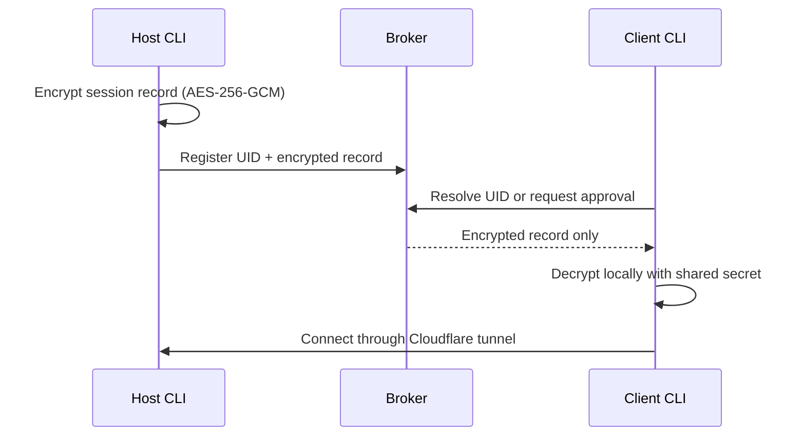

# iPingYou

SecureLink CLI for temporary remote access through SSH and Cloudflare Quick Tunnels. A host encrypts the session configuration locally, stores only the encrypted record with a broker, and shares a UID and session secret with the intended client.

> iPingYou is a remote-access tool. Give the UID, session secret, and mobile-dashboard link only to people you trust. A tunnel exposes the service selected by the host.

## What it does

- Host SSH, a one-time SCP download, a local HTTP service, or a custom TCP service.
- Create a Cloudflare Quick Tunnel without router port forwarding.
- Encrypt broker session records with AES-256-GCM and PBKDF2-SHA-256. Existing short-lived legacy CBC records can still be read during upgrades.
- Use a random 192-bit default session secret; hosts can supply their own secret instead.
- Optionally require host approval before a client receives the tunnel configuration.
- Create an ephemeral SSH key for passwordless client access and remove it during cleanup.
- Transfer files with SCP, browse local/remote paths, calculate checksums, and use an optional shared drop folder.
- Start a password-encrypted Web Crypto chat room, reverse SSH forwards, a local host dashboard, and a token-protected mobile status page.
- Record scoped session events, review history, export signed audit logs, and run diagnostics.

## Requirements

- Node.js **22.12.0 or newer**.
- `ssh` and `cloudflared` available on the host and client as appropriate.
- An SSH server running on the host for SSH/SCP modes.
- A reachable broker. The default public broker is offered interactively; hosts can also start a private local broker and tunnel it.

The runtime dependencies are `chalk`, `commander`, `express`, `express-rate-limit`, `execa`, `helmet`, `inquirer`, `ora`, `qrcode-terminal`, and `ws`. No removed or unrelated packages are required.

## Install and run

```bash
# Run the published CLI without a global installation
npx @miraj181/ipingyou@latest

# Start a host or client directly
npx @miraj181/ipingyou@latest host
npx @miraj181/ipingyou@latest connect
```

Global installation is optional:

```bash
npm install -g @miraj181/ipingyou
ipingyou --help
# `securelink` is an equivalent alias.
```

If a machine already has an older global `ipingyou` executable, it can shadow the `npx` binary. Remove or update that old global installation before relying on the shorthand command.

## Typical SSH session

1. Run `ipingyou host`.
2. Enter a session secret, or leave it blank to generate a high-entropy secret.
3. Select SSH and optionally enable host approval.
4. Share the displayed UID and secret through a secure channel.
5. The client runs:

   ```bash
   npx @miraj181/ipingyou@latest connect --uid <uid> --password <secret>
   ```

6. End the host session with its dashboard controls or `Ctrl+C`. Scoped cleanup revokes the broker record, stops iPingYou-owned processes, and removes temporary session artifacts.

## Security model

The broker is a rendezvous service, not a trusted decryptor:



- Broker records have a one-hour TTL, request limits, payload limits, and host-token protected controls.
- Re-registering an active UID requires its original host token; it cannot be anonymously replaced.
- Approval decisions bind to the broker-normalized client address. IP address checks are a safeguard, not user identity verification.
- The chat’s message contents are encrypted in the browser with AES-GCM. The host-close action requires a separate random host capability.
- The mobile page requires a random URL capability. It is served over the local network, so treat its full URL as sensitive and do not use it on untrusted networks.
- SSH host-key persistence is enabled by default. Do not disable host-key verification unless you understand the risk.

Encryption protects the session payload, not the endpoint you intentionally expose. A client with the session secret and a permitted SSH key can access the service for the lifetime of the session.

## Commands

| Command | Purpose |
| --- | --- |
| `ipingyou` | Interactive mode selector. |
| `ipingyou host` | Start a host session. Options: `--qr`, `--read-only`, `--record`, `--enable-web`, `--deny <patterns>`. |
| `ipingyou connect` | Resolve a UID and connect. Options: `--uid`, `--password`, `--limit`. |
| `ipingyou ai` | Start the optional Groq-powered assistant with command/path safeguards. Requires `GROQ_API_KEY`. |
| `ipingyou doctor` | Run non-invasive checks for dependencies, SSH, broker, SCP, AI, and tests. |
| `ipingyou panic` | Require a local typed confirmation, then stop resources owned by the current session. |
| `ipingyou service install\|stop\|status` | Manage the optional PM2 host service. |
| `ipingyou security-status` | Report Socket Firewall availability for npm installation workflows. |
| `ipingyou allowlist [list\|add\|remove] [pattern]` | Manage the local AI command allowlist. |
| `ipingyou history` | View session events, generate an AI summary, or export/verify signed audit logs. |

Run `ipingyou <command> --help` for current options.

## Resource behaviour

iPingYou is designed for bounded, short-lived sessions:

- Broker session payloads are limited in size and count, expire automatically, and are pruned every five minutes.
- Broker telemetry and approval records are capped per UID.
- Session logs are capped at 2 MiB; retained history rotates at 5 MiB.
- Crypto/checksum work uses one unreferenced worker with a 128-task queue and a 128 MiB old-generation cap; it is terminated after 30 seconds idle.
- Tunnel restart uses a two-second backoff. Dashboard event polling backs off from 5 to 20 seconds when unchanged.
- Chat messages are limited to 64 KiB, and its local server is closed during session cleanup.

Long-running SSH, SCP, Cloudflare, and PM2 processes naturally consume resources while active. Stop a session when it is no longer needed.

## Development

```bash
npm test
```

The test suite covers helper safety, security regressions, authenticated encryption/tamper rejection, and a self-starting broker integration test.

## License

[MIT](LICENSE) © Sk Mirajul Islam
